

 

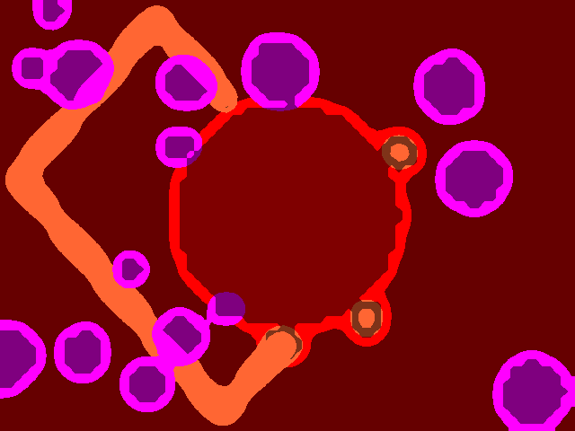

## The game

A small game made during the [Discord LibGDX jam 1]({{ site.baseurl }}/articles/discord-libgdx/jam.html) 24th-25th February 2018.

Game jam rules was to use LibGDX to create a game or whatever over the weekend (48 hours).

Game jam theme was **"3 colors, 3 buttons"**.

Features :

* LibGDX arcade game
* No assets
* Post processing / shader based GFX

BIOHAZARD is licensed under a [Creative Commons Attribution-NonCommercial-ShareAlike 4.0 International License](http://creativecommons.org/licenses/by-nc-sa/4.0/).

<h3>Playthrough by <a href="https://www.youtube.com/channel/UCZhkLaB67rHVjwH1PFai0SA" target="_blank">Raeleus</a></h3>
<iframe width="420" height="315" src="https://www.youtube.com/embed/AVxSVSjcXBc?start=286&autoplay=0" frameborder="0" allowfullscreen></iframe>

## Making off

Because this is a game and i want it to be fun, I firstly focused on the gameplay.

I didn't want to have 3 classical GUI buttons but 3 controlled entites.

The idea was an arcade/defender/shooter game so i first prototyped it with flat shapes.

The main works was to have nice collisions (without box2D) and i know LibGDX is missing some collision algorithms like i was needed : moving sphere VS static sphere collisions, so i had to implement it (i could propbably make a PR of it to LibGDX later though).

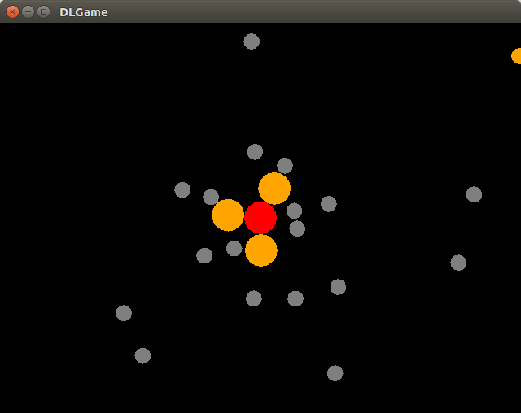
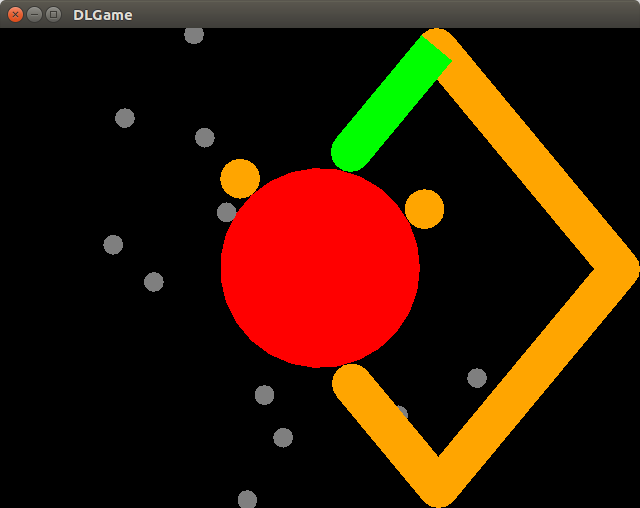

Like any gamejam it's always interesting to test a new feature and for this one, according to the gameplay, I wanted to experiment a kind of "blobbing", that is shapes fusion giving a feeling of blobs, gelly, etc.

I recently worked on post processing effects and convolution filters with shaders so i decided to use this kind of tricks for blobs.

And since the second gamejam constraint was 3 colors, I definitely thought it was a job for pixel shaders as well.

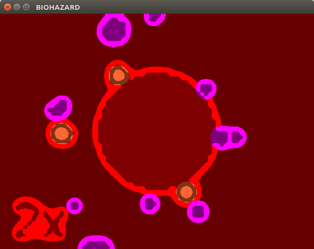
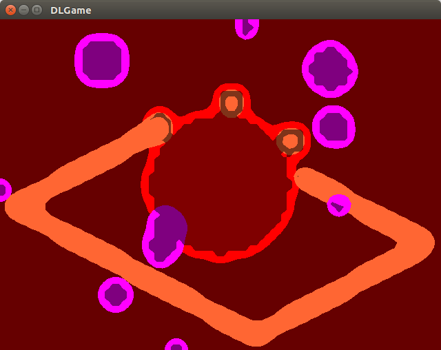

Prototype was fine and i wanted to test this GFX with fonts, it was the perfect time to implements other game screens and screen flow.

From here, no assets like PNGs was used and I didn't want to use assets at all, this could be a good example of "how to make a game without assets". The only asset I used is the provided defaut font from libGDX jars (always available) but no extra assets ! Only programmatically stuff, even fot the Scene2D/Skin part.

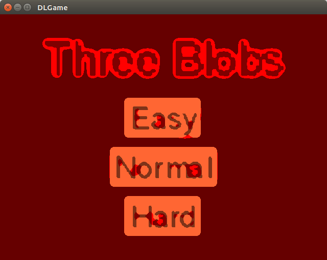
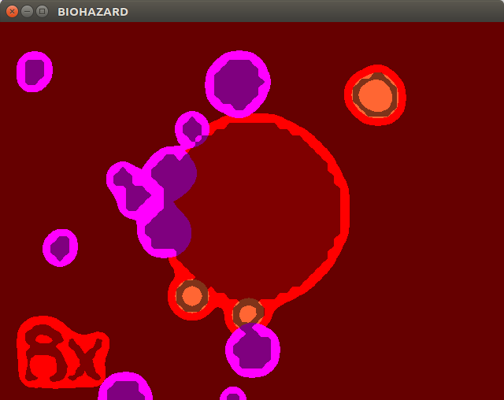
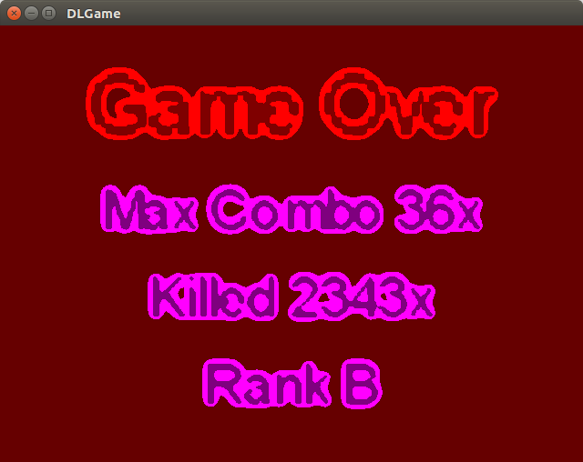

Then time to make the final touch : I wanted to have the 3 colors in each screens : good time to change game title, add a sub title (i always like that).

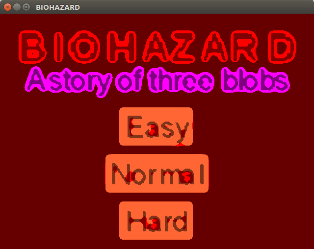
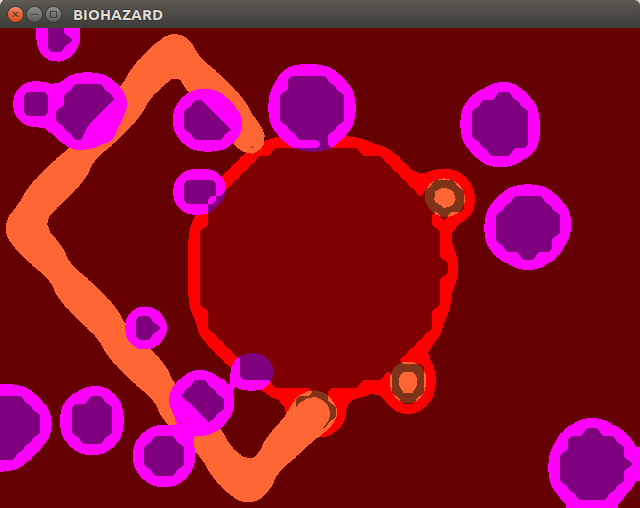
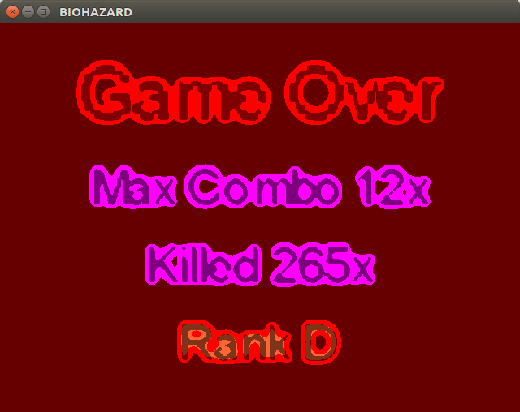

Finally, some bug fixes and gameplay balance improvements to try to have a fun game. Then publish to itch.io and Submit !

Futur works i'm thinking (post gamejam) : 

* Cleanup/refactor sources in order to be used as small example for beginners.
* A friend of mine suggest me to publish for Android adding vibration feature : i like it and surely do it.
* Maybe pusblish as HTML5 game to allow playing the game online (and see if my GFX works fine with WebGL)

Thanks for reading !