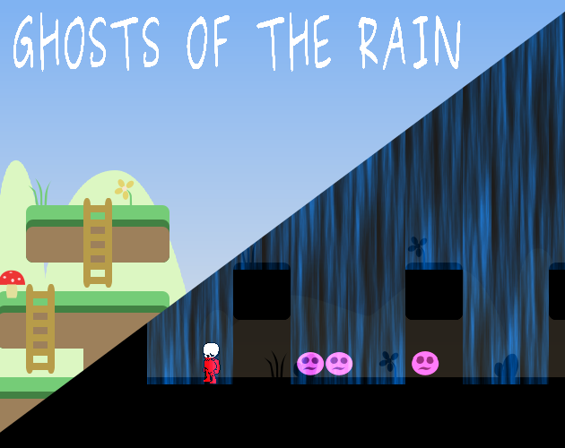
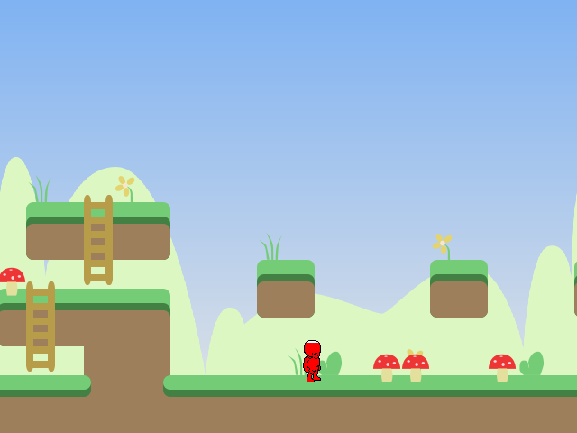
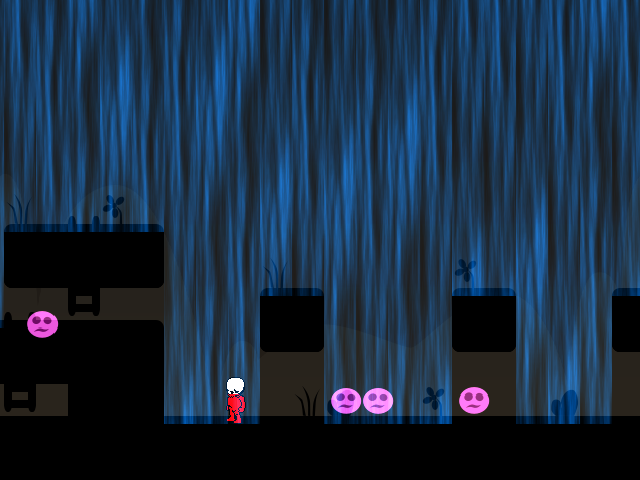
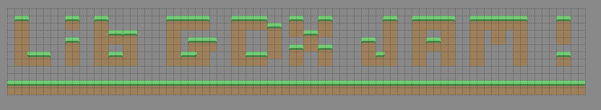
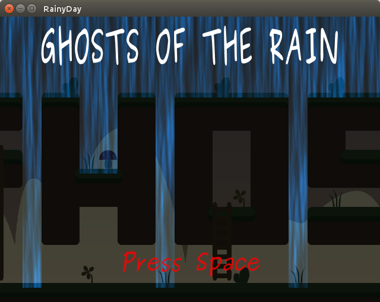



 

## The game

A small game made during the [Discord LibGDX game jam 2](https://discordapp.com/invite/6pgDK9F) 31th March - 1st April 2018.

Game jam rules was to use LibGDX to create a game or whatever over the weekend (48 hours).

Game jam theme was **"Rainy Day"**.

Features :

* LibGDX platformer game
* Random Tiled Map sequence at each new game
* Shader based GFX

Ghosts of the rain is licensed under a [Creative Commons Attribution-NonCommercial-ShareAlike 4.0 International License](http://creativecommons.org/licenses/by-nc-sa/4.0/).

## Gameplay and theme

The idea was to alternate sun time and rain time and try to implement a game mechanic based on it.

The gameplay loop is the following :

* after the rain, some mushrooms grow and can be picked up to restore player life.
* when it's rainning again, remaining mushrooms are transformed into ghosts moving toward player to hurt him.
* when rain stops, monsters disepear and new mushrooms appear.

Rain hurts as well. So player have to deal with :

* find a shelter to not be hurted by the rain.
* flee from monsters.

During sun time, player have to pickup as many mushrooms as he can to restore his life and limit futur monsters.

## Making Off

### Where did i lost time ?

As usual, i lost lot of time with tiled map collisions :

* computing player bounds to tiles.
* allow or not some player moves (climp ladders, move to the left or to the right)

I really need to create some utility classes for future games or game jams including basic collisions, ray casting, moving shapes clipping and so on.

### What could be reused ?

The most interesting part of code i could reuse and improve is the TiledMapStream.

It's been a long time i wanted to implements a kind of dynamic tiled map where some parts are streamed dynamically : there is plenty of games implementing it.

This first implementation works well for this game but is could be improved in several ways for other games : 

* backward streaming.
* support other layer types (objects, images, etc).
* both horizontal and vertical streaming.
* improve performances with 4 maps to avoid full recopy.

### What was fun to do ?

Once tiled map streams in place, it was straightforward to add new level parts especially funny ones :

* one of a level part is a tiled map whith words : "LIB GDX JAM !"

* the menu screen is a tiled map whith words : "GHOSTS OF THE RAIN"

## Futur work 

Some features i'm thinking of (post gamejam) : 

* Music and SFX.
* Dynamic map sequence at runtime either randomly or based on player skill.
* More maps.
* More decorative tiles.
* Better backgrounds.
* Distance counter with a score screen.

Thanks for reading !
