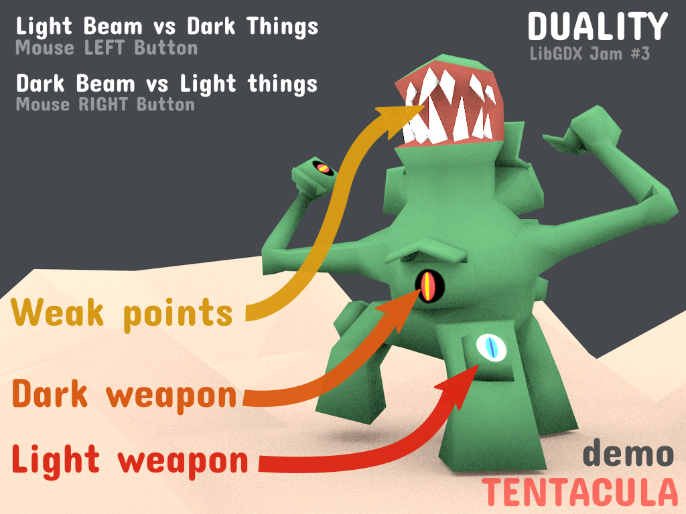
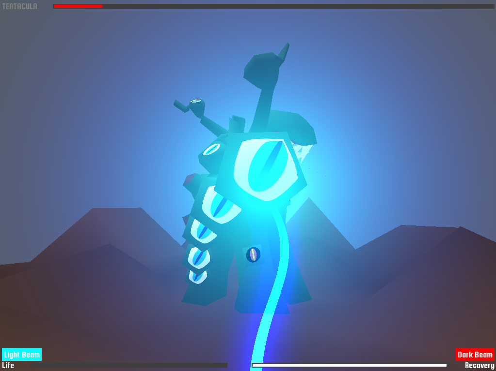
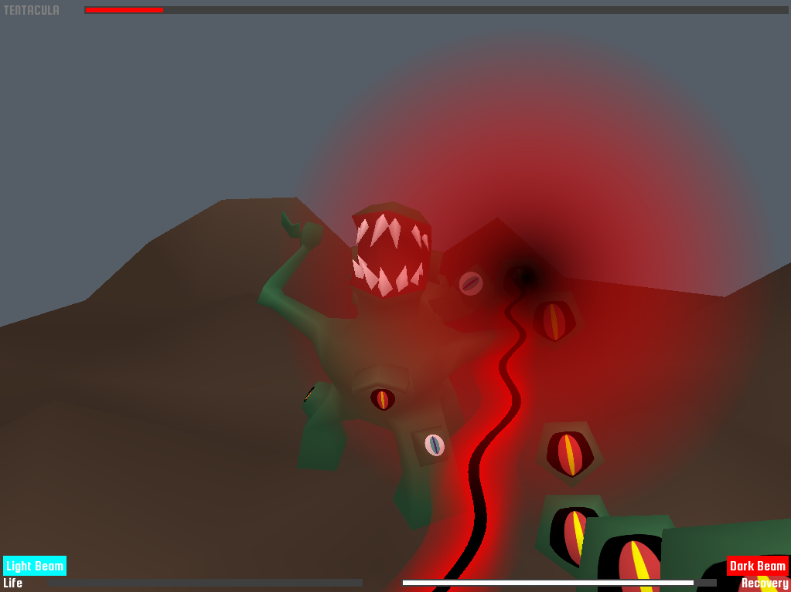
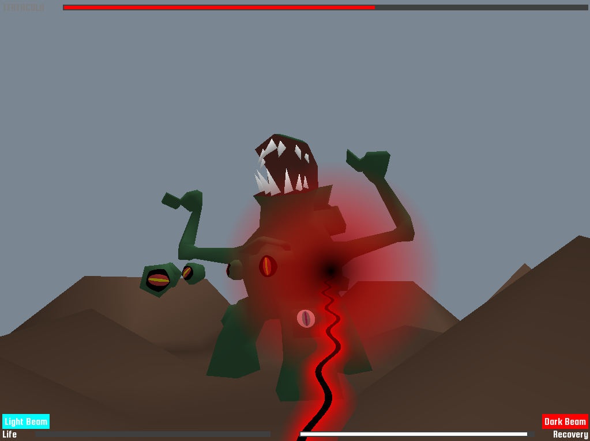
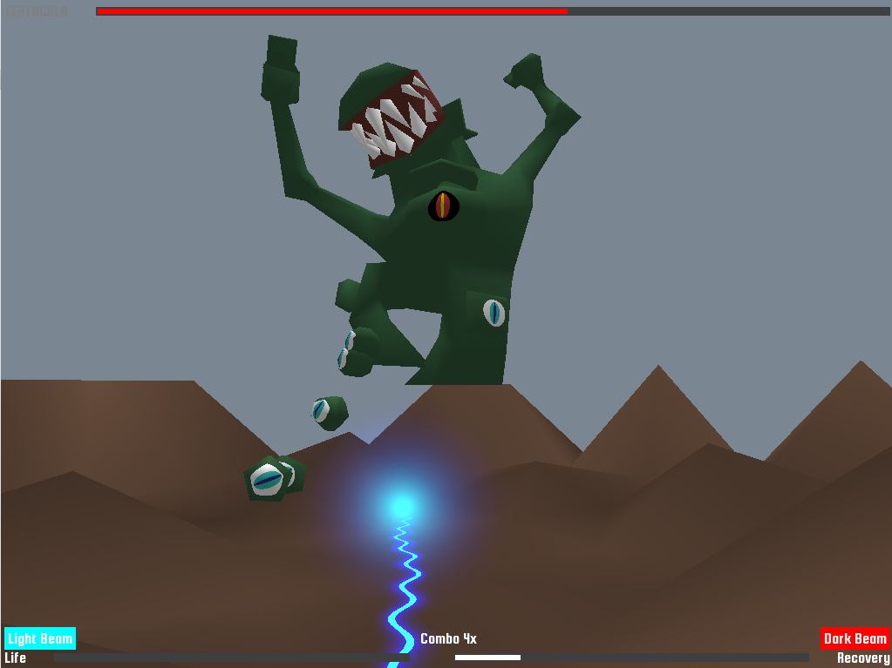



 

## The game

A small demo made during the [Discord LibGDX jam 3]({{ site.baseurl }}/articles/discord-libgdx/jam.html) 26th - 27th May 2018.

Game jam rules was to use LibGDX to create a game or whatever over the weekend (48 hours).

Game jam theme was **"Light vs Dark"**.

Features :

* LibGDX 3D game
* FrameBuffer based collisions
* Some shader GFX

It was inspired by 2 games : 

* **Ikaruga** for the theme : the light beam kills dark entities and dark beam kills light entities.
* **Panzer Dragoon** for the gameplay : A 3D shooter with fixed trajectory.

This is an unfinished game, more like a demo : neither player or boss dying as of now.

Duality is licensed under a [Creative Commons Attribution-NonCommercial-ShareAlike 4.0 International License](http://creativecommons.org/licenses/by-nc-sa/4.0/).

<h3>Playthrough by <a href="https://www.youtube.com/channel/UCZhkLaB67rHVjwH1PFai0SA" target="_blank">Raeleus</a></h3>
<iframe width="420" height="315" src="https://www.youtube.com/embed/AVxSVSjcXBc?start=3152&autoplay=0" frameborder="0" allowfullscreen></iframe>

Thanks for reading !
