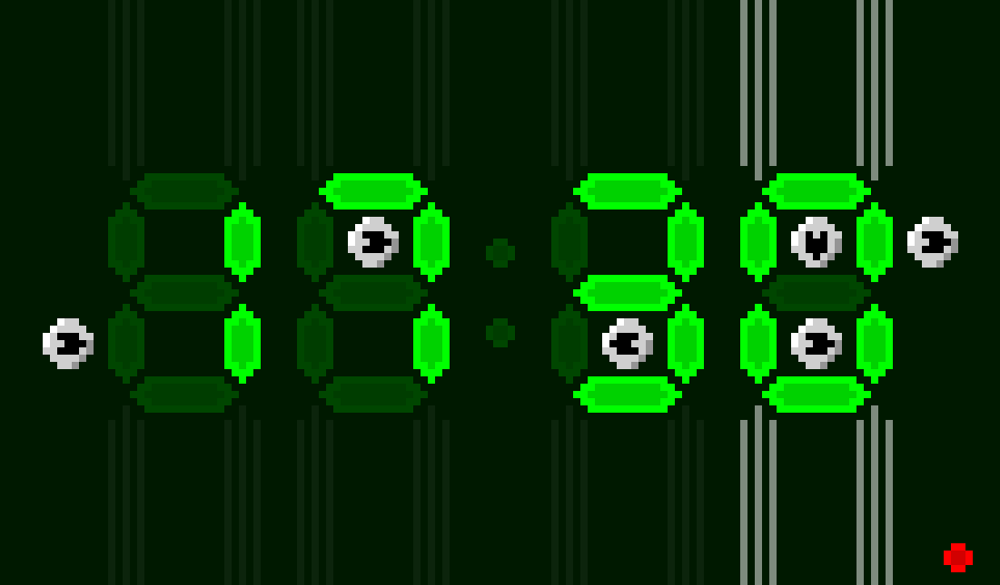



 

## 24th Hour

A puzzle game made during the [Discord LibGDX game jam 5](https://bigbass1997.com/libgdx/jam/entries.php?jid=5) 27th - 28th October 2018.

Game jam rules was to use LibGDX to create a game or whatever over the weekend (48 hours).

Game jam theme was **"Time"**.

Thanks for reading !
