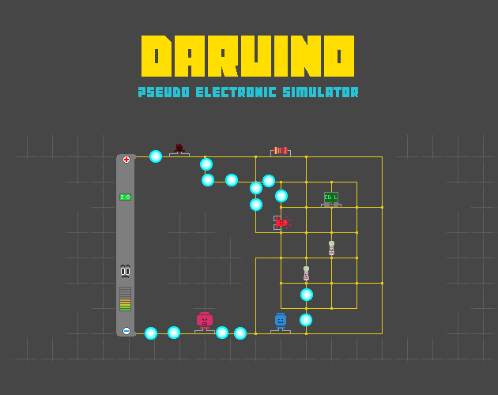
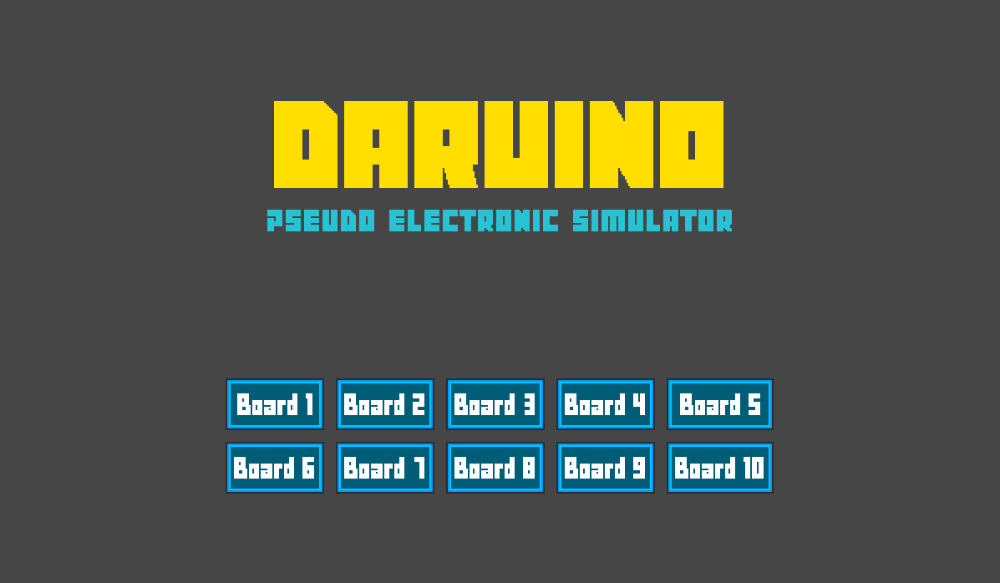
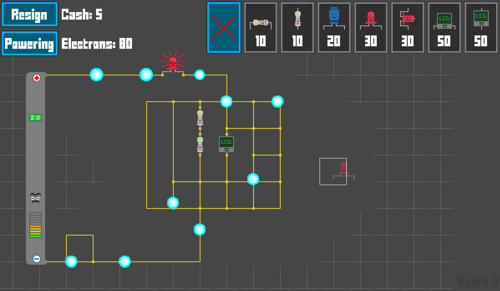
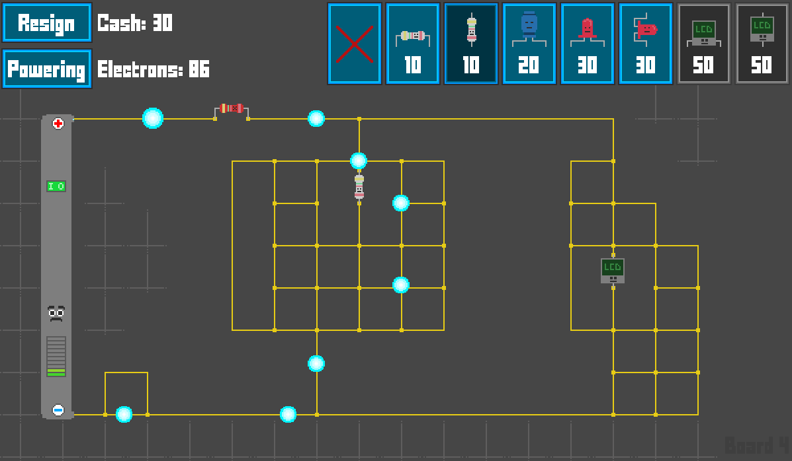



 

## Daruino

A tower defense made during the [Discord LibGDX jam 6]({{ site.baseurl }}/articles/discord-libgdx/jam.html) 22th February - 1st March 2019.

Game jam rules was to use LibGDX to create a game or whatever over the week.

Game jam theme was **"Energy"**.

Thanks for playing !

