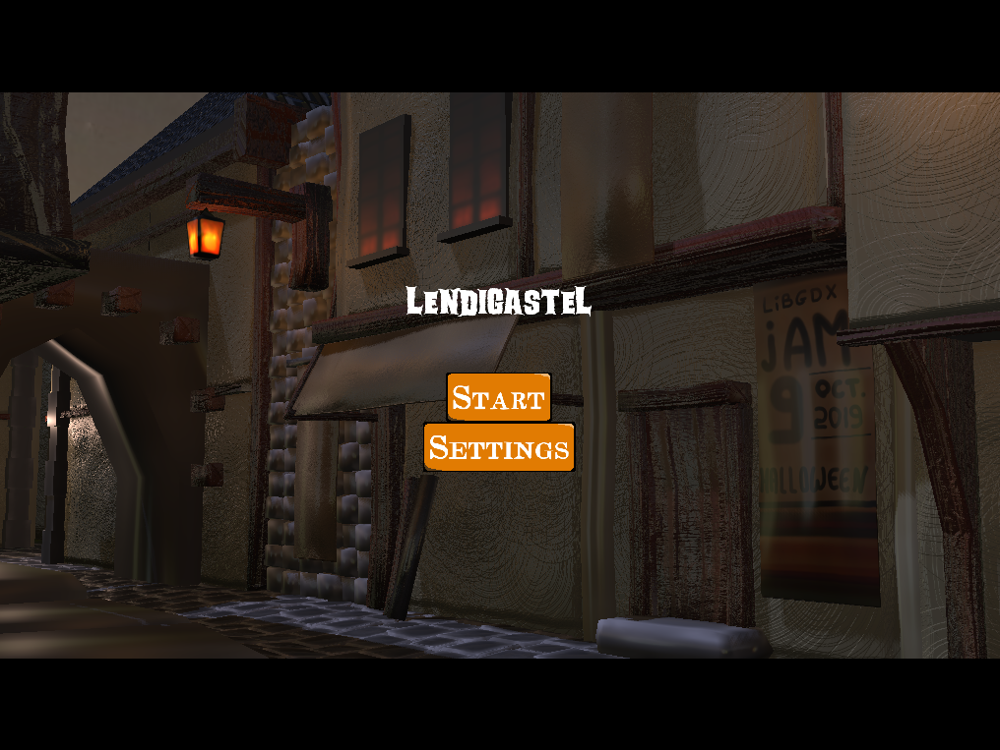



A small game made during the [Libgdx Discord game jam 9](https://itch.io/jam/libgdx-jam-october-2019) 20th-28th October 2019.

Game jam theme was **"Halloween"**.

### Bonus

You can take a look at [Lendigastel making off](makingoff.html)

### Playthrough made by a youtuber ###

<iframe width="420" height="315" src="https://www.youtube.com/embed/ATo8vh9pk-4?t=45&autoplay=0"></iframe>

<iframe width="420" height="315" src="https://www.youtube.com/embed/ghK0XG13RHA?t=161&autoplay=0"></iframe>

<iframe width="420" height="315" src="https://www.youtube.com/embed/ES_69TTDmW8?autoplay=0"></iframe>

