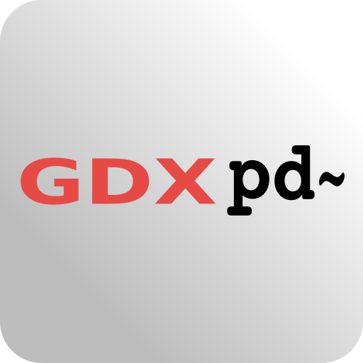
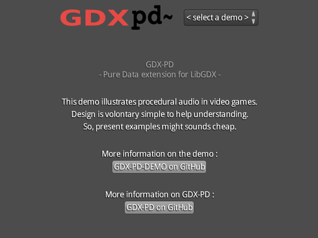
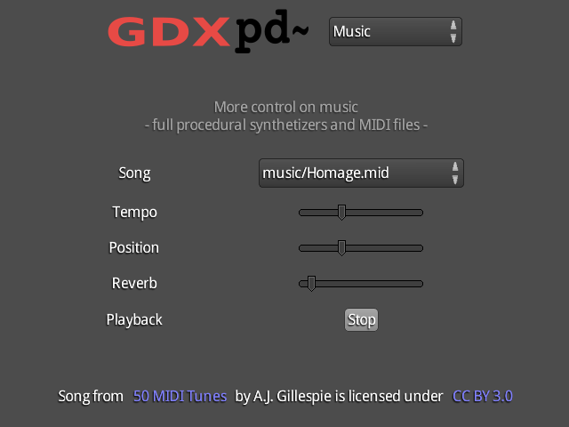
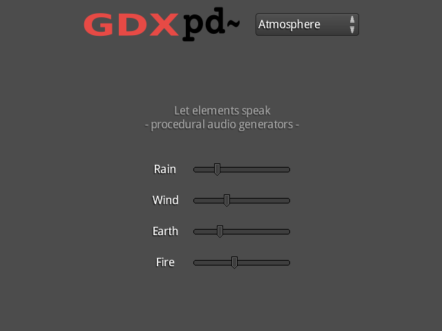
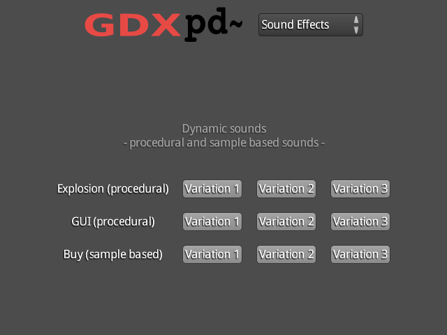
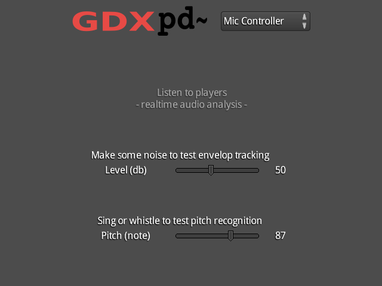
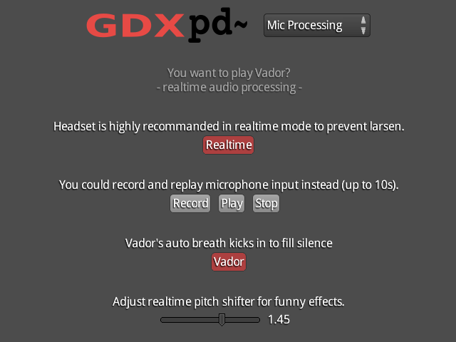

<h3>Puredata extension for LibGDX</h3>

Gdx-pd is a Puredata wrapper for Libgdx. It brings a powerful audio library to the game framework. More information on [the github repository](https://github.com/mgsx-dev/gdx-pd#introduction)

A demo illustrates some audio features that could be acoomplished in a game. Available both for [Android](https://play.google.com/store/apps/details?id=net.mgsx.pd.demo) and [Desktop](https://github.com/mgsx-dev/gdx-pd-demo/releases) platforms. Demo source code available [here](https://github.com/mgsx-dev/gdx-pd-demo)

  

  

  

