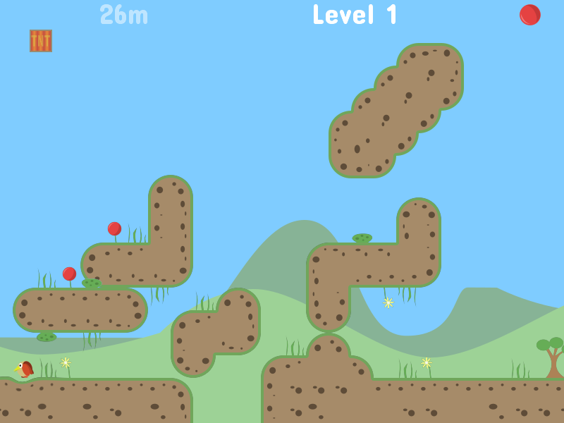
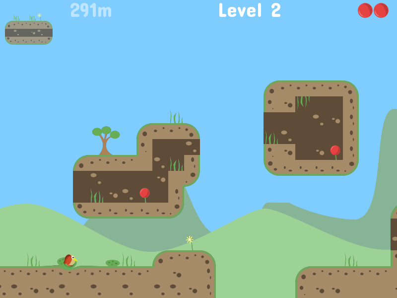
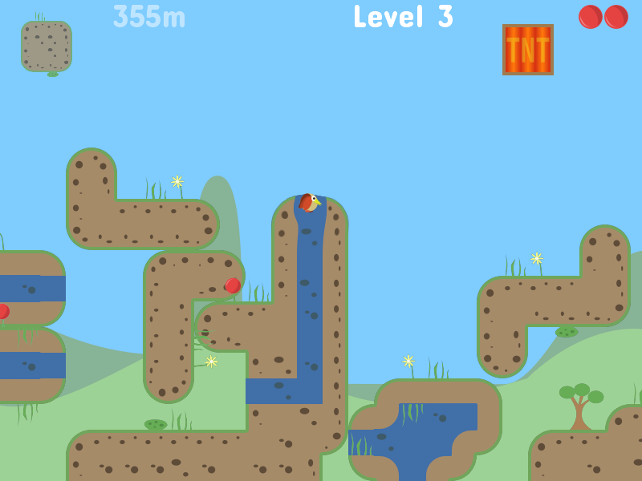
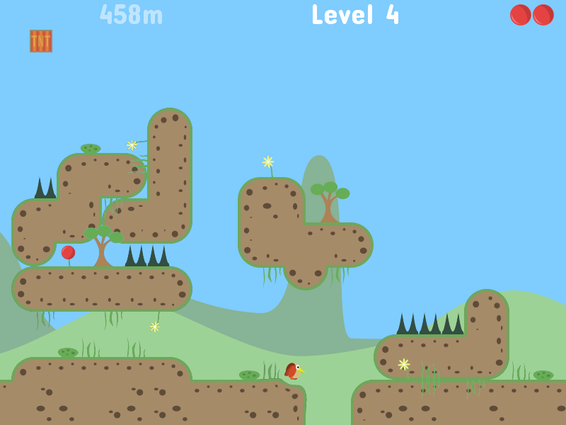
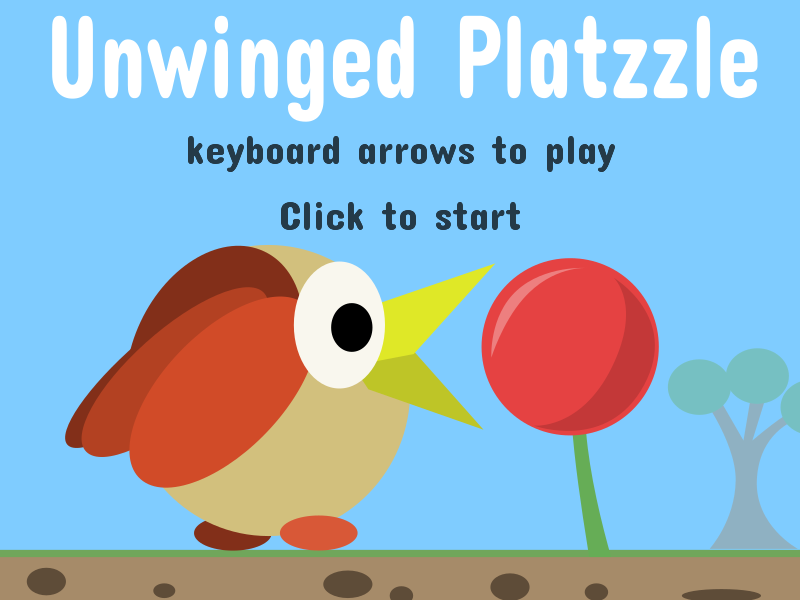
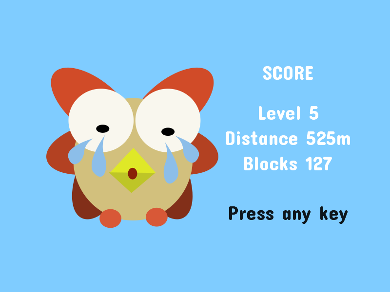



A small game made during the [Ludum Dare 41 game jam](https://ldjam.com/events/ludum-dare/41) 21st-22nd April 2018.

Game jam rules was "compo" competition : made by one developer (game and assets) in 48 hours.

Game jam theme was **"Combine 2 Incompatible Genres"**.

The idea was to mix a platformer with a puzzle game like tetris : player only controls the blocks not the hero.

Final results soon.

Here is some screenshots :

