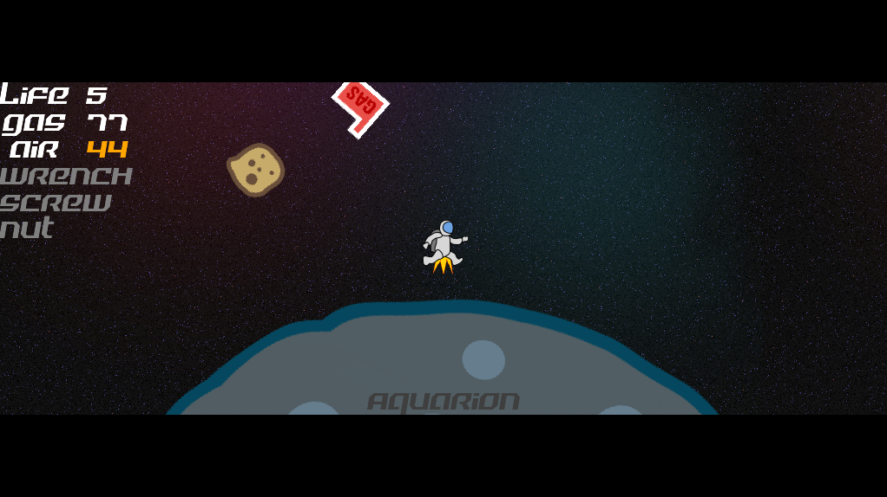
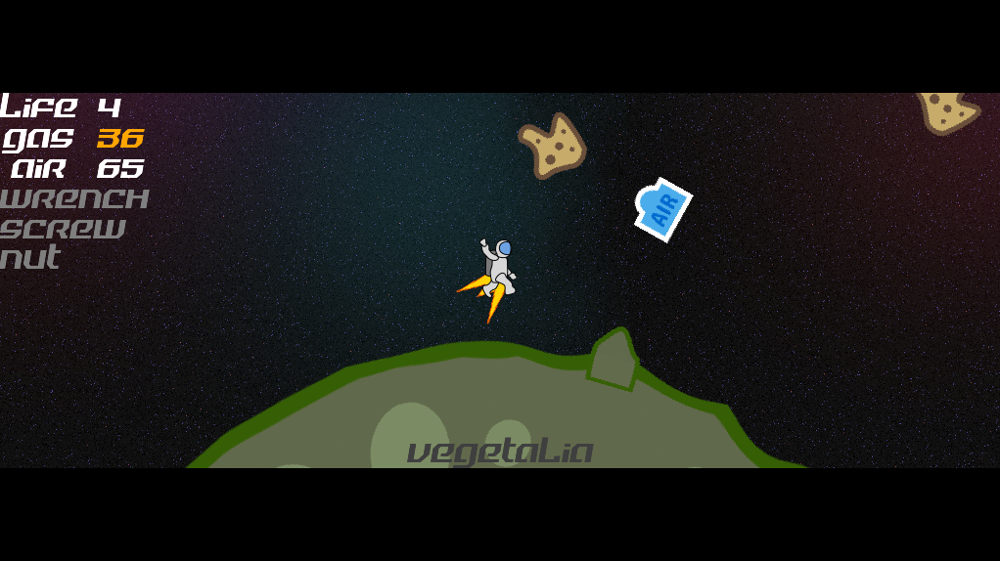
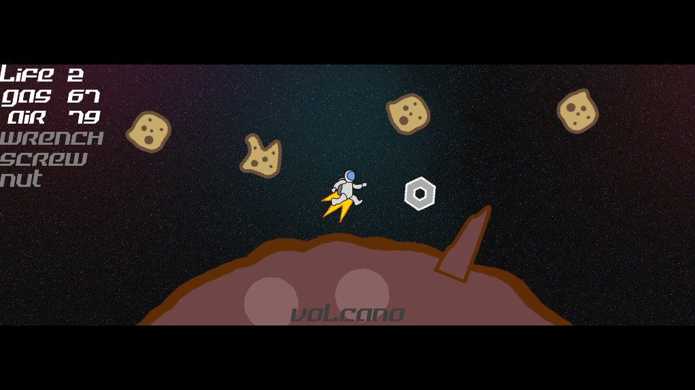
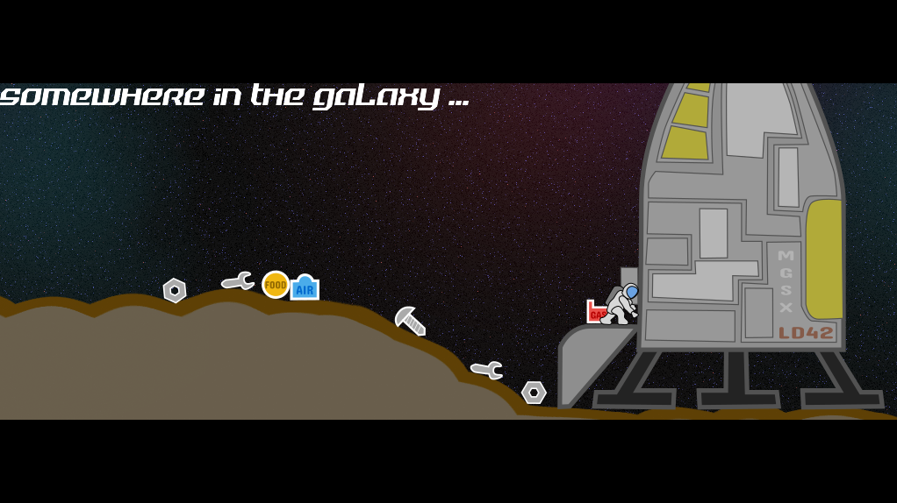



A small game made during the [Ludum Dare 42 game jam](https://ldjam.com/events/ludum-dare/42) 11st-12nd August 2018.

Game jam rules was "compo" competition : made by one developer (game and assets) in 48 hours.

Game jam theme was **"Running out of space"**.

The idea was to mix a platformer with a puzzle game like tetris : player only controls the blocks not the hero.

Final results over **1056** submissions in same competition : 

| *Rating* |--- *Score* ---| *Ranking* |
|----------|:-------------:|:---------|
| Overall | **3.5** / 5 | **268** th |
| Fun | **3.5** / 5 | **220** th |
| Innovation | **2.7** / 5 | **600** th |
| Theme | **3.1** / 5 | **559** th |
| Graphics | **3.5** / 5 | **260** th |
| Audio | **3.6** / 5 | **98** th |
| Humor | **3.0** / 5 | **158** th |
| Mood | **3.1** / 5 | **269** th |

Here is some screenshots :

