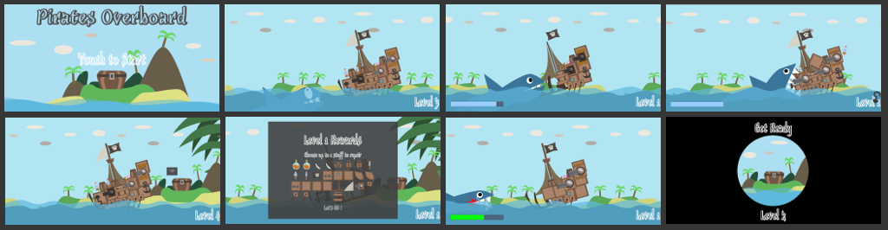



A small game made during the [Ludum Dare 43 game jam](https://ldjam.com/events/ludum-dare/43) 1st-4th December 2018.

Game jam rules was "jam" competition : made by a team (game and assets) in 72 hours.

Game jam theme was **"Sacrifices must be made"**.

Final results over **1750** submissions in same competition : 

| *Rating* |--- *Score* ---| *Ranking* |
|----------|:-------------:|:---------|
| Overall | **4.0** / 5 | **78** th |
| Fun | **4.0** / 5 | **54** th |
| Innovation | **4.0** / 5 | **39** th |
| Theme | **4.4** / 5 | **24** th |
| Graphics | **3.9** / 5 | **317** th |
| Audio | **3.8** / 5 | **139** th |
| Humor | **3.8** / 5 | **123** rd |
| Mood | **3.6** / 5 | **268** th |

### Playthrough made by a youtuber ###

<iframe width="420" height="315" src="https://www.youtube.com/embed/nzAPByJu23A?autoplay=0"></iframe>

### Here is some screenshots ###

