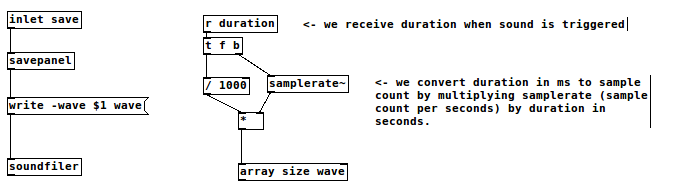

I just tested BFXR [http://www.bfxr.net/](http://www.bfxr.net/) yesterday and told myself "hey! I can do it with Pure Data! It could make a great tutorial for PD beginners". That's the motivation of this article.

This article doesn't require any PD knowledges but some features like controls and load/save require some advanced PD knowledges and are covered in the article appendix for a full comprehension of the final patch.

Note that we won't respect all BFXR implementation, we'll follow the main principle but takes some liberty for parameters range and organization. Not all BFXR features will be implemented here and we'll add some extra features as well.

You can download patch version at each step in this tutorial in order to understand the progression but you can download the final application as [zip file here](pd/pfxr.zip). Just extract it and open the **pfxr.pd** file and smoke it :-).

# First sound

Let start with a basic sin waveform and a decay :


[download](pd/1.pd)


# Control the envelop

To emulate BFXR we will introduce GUI slider to control a full Attack/Sustain/Decay (ASD) envelop.


[download](pd/2.pd)


# Refactor controls

Our patch will get a lot of control and we need something simpler to maintain. We can make reusable modules with PD, these modules are called "Abstraction".

Abstraction can just contains processing object but could have a GUI as well. Since this abstraction involve advanced PD knowledge, we will use it as-is, full explanation is available in appendix. Futhermore this abstraction will contains more features for storage, randomization, ... and its implementation is beyond the scope of the heart of this article.

We name it "control" and pass it few parameters :

* the control name used for messaging and storage or presets.
* a minimum value
* a maximum value

For instance in our patch we create a control named "attack-time". When we change its value, the abstraction will send a global message to symbol "attack-time". In our main patch these messages can be obtain with the receive object (r attack-time)

Note that an abstration is a separated file and you will need to [download this file](pd/control.pd) to the same folder as other pd files.


Then we adapt our patch to use the control abstraction for the previously created ASD controls. Note that "control-change" message trigger the sound now!


[download](pd/3.pd)

# Wave form visualization

Another nice feature is to view the wave form


[download](pd/4.pd)

OK enough with GUI, lets back to the sound!

# Control the frequency


[download](pd/5.pd)


# Wave forms

BFXR provides 9 waveforms :

* triangle
* sin
* square
* saw
* breaker
* tan
* whistle
* white
* pink

In order to control what we're doing we will add a visializer for our waveform shape.


[download](pd/6.pd)

Our path become messy and since we had a lot of things to add, we will refactor it a little by separating things.

We already know abstractions but pd provides another kind of custom object know as "subpatch" it is used to group object together to have cleaner patch.
Lets group logical things : 

* the ASD envelop
* the waveform sampler

Our ASD subpatch :


And our wave form sampler :


And the result is really cleaner you don't think ?


[download](pd/7.pd)


## Saw

Let's create the saw signal and the waveform switch controller. Again to simplify, we will group all waveforms in a subpatch.

Here is our final patch :


[download](pd/8.pd)

Here is our waveforms selector :


Here is our previously sin. Note that we introduced a switch~ objetct. This ensure to not process audio when DSP is off. It saved some CPU.


And finally our saw signal :


## Triangle

TODOC


## Square

TODOC


## White


TODOC

## Others

TODO : ???

# More FX

## Tremolo

This effect is not part of BFXR/SFXR but it's simple, easy to understand and an interesting effect.

The tremolo is a low frequency signal which modulate the whole sound amplitude. To have a natural tremolo, we'll use a sinusoid signal (osc~).

The depth is how much modulation is apply to main signal. Look at the output signal curve, we can visualize the LFO (Low Frequency Oscillator) effect.


Look at the output signal curve, we can visualize the LFO (Low Frequency Oscillator) effect.


And below you can see how we integrated in our patch :


[download](pd/9.pd)

## Vibrato

Vibrato effect is closed to tremolo but apply to frequency instead of amplitude. This effect simulate violin vibrato when player oscillate his finger which produce a tiny modulation of string length and then frequncy. Guitarist knows well this effect with use of mecanical vibrato or bending the strings with their fingers.

Again for a natural vibrato we're using a sinusoidal signal. The depth is how much modulation is apply to main frequency we control so far.

Here is our vibrato subpatch. Note that this time we won't connect any portlet to/from our vibrato but use a named signal instead. This work like messages send and receive but apply to audio signal. This avoid to have a messy patch with lot of connections.


Then we adapt each waveform generators to apply the frequency modulation. We name it "FM" for "Frequency Modultation", we'll add later more effect on frequency using this named signal as the final frequency modultation. Note that generators like noise doesn't have base frequency. Here is an example of how we apply it to the "sin" waveform, it's the same principle for all other waveforms.


You can [download](pd/10.pd) the main modified patch.


## Bit crusher

Let's move to a huge effect which simulate low-fi / old 8-bit games.


Then we just apply this effect as the last stage of our audio chain :


[download](pd/11.pd)

Since we need the sound trigger message, we have a ugly wire traversing the whole patch. It's time to cleanup a little. In PD you always have 2 ways to connect objects with message flows. Both approach have pros and cons :

* with a wire : flow is easy to follow/understand but it could be messy sometimes and kill the understanding.
* with send/receive objects : you need to define a unique name and flow is less easy to follow/understand.

There is no drawback in term of performence it's just a choice of design : In our patch, the "trigger" event is already used in a lot of places and will be used in many placed as we implements new effects so it's a good choice to use send/receive instead of wires. Here is the result :


[download](pd/12.pd)

# Export to wave file

OK we already have something valuable, it produce interesting sounds and maybe we already want to use them in our games or any other apps. So let's implements a wavefile export.

PD provides all you need to import/export raw PCM audio files like WAV and AIFF from/to arrays and system file browser feature. We already have a array/table to display our sound so we could use it but to export a well cuted audio we'll need to resize array depending of audio length. The length of the generated audio depends on the amplitude envelop : it's the sum of attack, sustain and decay durations, so let's compute it and send it from our ASD envelop :


We already have a table storing our sound, we will resize it to the total duration which fix a bug we had so far : the wave preview wasn't resizing to the sound length.

Now we can use the duration message to resize our table before start recording when sound is triggered. This is the right part of our subpatch.

At the left, it's the save flow : 

* first a bang is received to order an export
* then "savepanel" open a system file browser
* then the path choosen is used to form the soundfiler command : writing the wave table as WAV format to the choosen file path.




Finally, we just add a button in the main patch :


And the wave file in audacity :


You can [download](pd/13.pd) the whole patch.

# Randomize preset

One cool feature in BFXR is preset randomization. It allow to randomize all or a part of parameters. You may noticed a toggle button for each controls we added, this is the lock feature. When you randomize the current preset, you may want to not randomize all of them, just enable the toggle and the parameter won't be touched.

The implementation is part of control abstraction and explain in appendix. We just add the randomize button (which send a global "randomize" message) and trigger the sound as well when we randomize the preset to hear the result instantaneously.


[download](pd/14.pd)

# Store presets

Export to a wave file is nice but we want to save control settings as well to reload then later and organize a preset library for futur use.

I present here features, as said before this is an advanced feature explained in appendix.

The abstraction is called "presets" and like control abstraction you need to have the file in the patch folder, you can [download it here](pd/presets.pd).

here is how it is integrated in our main patch :


[download](pd/15.pd)

Here is what we get in file :

```
bit-crush 0.82486;
bit-sweep 0.619019;
vibrato-depth 0.701447;
vibrato-speed 10.9007;
tremolo-depth 0.704163;
tremolo-speed 9.47609;
decay-time 878.693;
sustain-time 299.5;
attack-time 722.534;
frequency 2902.35;
```

This work as expected but something missing : the selected waveform. The reason is didn't use a control abstraction but a simple selector. Let's replace it with a "select-control" abstraction which is close to control but using a selector instead of a slider.

like control abstraction you need to have the file in the patch folder, you can [download it here](pd/presets.pd).

You can [download the fixed patch here](pd/16.pd). Note that we defined a range of 5 in order to randomizer to choose between waveform we implemented so far.

We can then create some predefined preset like BFXR does. Some presets are provided in the final application. 
TODO : add some preset in it (like pfxr ...)


# More FX (part 2)

OK enough with technical feature, we're to make some sounds, so let's back to our audio core flow and implements other effects.

## Pitch jumping

The pitch jump feature in BFXR is actually a kind of arpegiator or sequencer applying to the pitch. So it's just 2 square signal with independant range and frequency added to 
waveform pitch. Each range from +/- one octavia (half to twice original frequency) so we need to convert.

Pitch jumping will modulate frequency like vibrato we seen before. We'll rename the old "vibrato" subpatch to "pitch" and implement into it : sum-up these modulations.

We'll take some liberty here from BFXR implementation to achieve more variations : 

* a square singal to simulate note jumping
* a speed of this signal
* a range for it
* and a ramp to slide the frequency


[download](pd/17.pd)


# Finalization

Here is few improvement made for the final patch :

* allow to lock/unlock all parameters.
* created some built-in presets to easily jump to different type of sounds :

  * default.txt : sin without FX
  * explode.txt : a decimated explosion
  * bonus.txt : pitch jumping demo


you can download the final application as [zip file here](pd/pfxr.zip)


# Where to go from here ...

Obviously we didn't implements all the FX you can found in BFXR/SFXR but we have something usable and you can improve it on your own now including :

* missing waveforms or other waveforms you'd like to have.
* preset mix/mutation
* punch, compression, square duty cycle, flangers, filters

Thanks for reading.


# Appendix

appendix will be covered soon.

## Control

We cover here the control abstraction we used so far. It imply lot of pd knowlegements : how GUI element work, messaging, ... etc.

TODO explain

### Auto-play

A nice feature in BFXR is the autoplay when value change. Lets implement it with PD. We will send a global message when a control value change as well.

TODO explain here advanced PD use : control name binding, graph on parent ... etc

## Save to a file

There is several ways to save audio in pd. For this patch we'll just record the sound based on the band event and duration auto set to sample length (total envelop).

TODO explain

## Save/Load preset

TODO explain