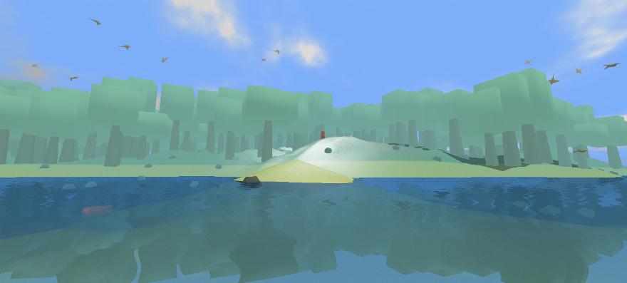

<h3>Puredata VR workshop</h3>

This workshop goal is to create the audio engine for an open world game using Puredata. It includes events sound design, environement reactive sonification and 3D spatialization.

All course and necessary tools for this workshop are [available on github](https://github.com/mgsx-dev/pd-vr-workshop)

It was originaly created for classes at the [Centrale Nantes engineering school](https://www.ec-nantes.fr/)

