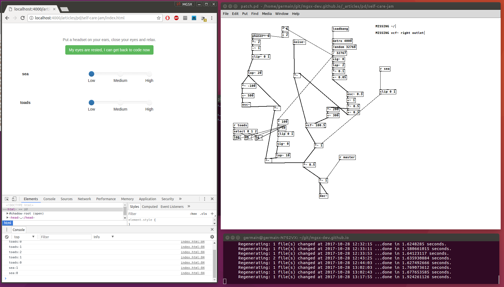
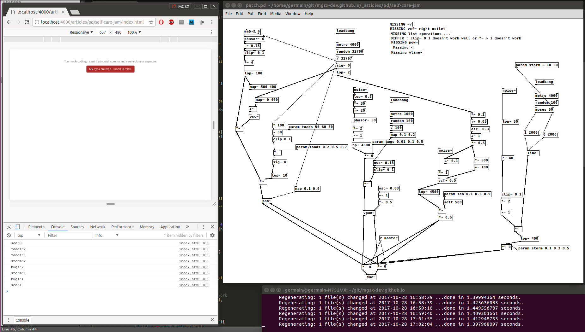
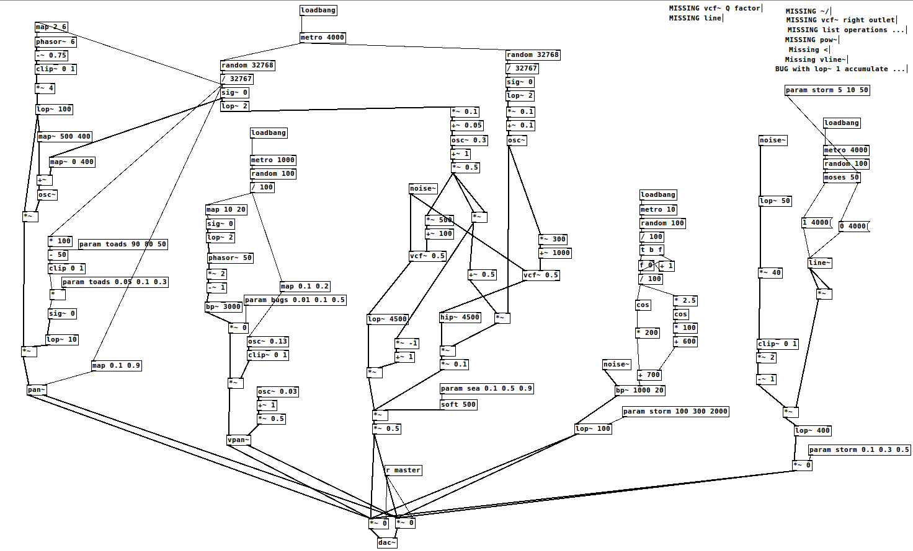



A small procedural audio application made for the [Self-Care Jam 2](https://itch.io/jam/self-care-jam-2)

It illustrates use of [WebPD](https://github.com/sebpiq/WebPd) to make procedural audio with HTML5 and Web Audio API.

Final version is available for [download here](self-care-jam.zip).

Here is some screenshots showing progress :

